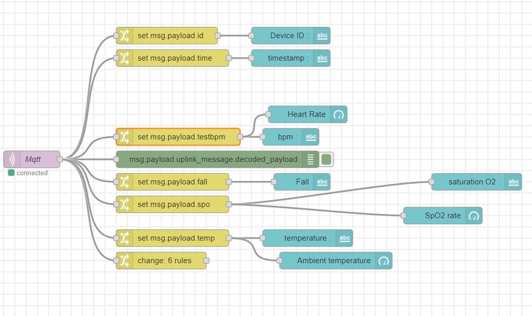

# Node-Red Configuration 
Le serveur Node Red nous permet d’afficher les données transmises depuis les capteurs via une connexion au broker Mqtt. Les nœuds configurés nous permettent de décoder les données et de les retransmettre dans un dashboard où elles sont visualisées sous la forme d’un graphique ou d’un texte.

Pour la connexion au broker Mqtt, nous utilisons le nœud Mqtt-In, nous définissons le serveur aux quelle nous sommes connectés et l’abonnement aux topics. Il s'agit du serveur The things network dans lequel en génère une clé qu'on introduit dans le node Mqtt pour nous authentifie et sécurise le trafic des données.

Les valeurs récupérées via le node Mqtt sont en base 64. Node Red fait un décodage automatique et le noeud permet de récupérer les données sous format Jason. Dans le but d'afficher ses données séparément, chaque valeur décodée est réinitialisée sous de nouvelles variables payload via le noeud change. Ces valeurs sont ensuite transmises aux nœuds graphiques et textuels du Dashboard.  
